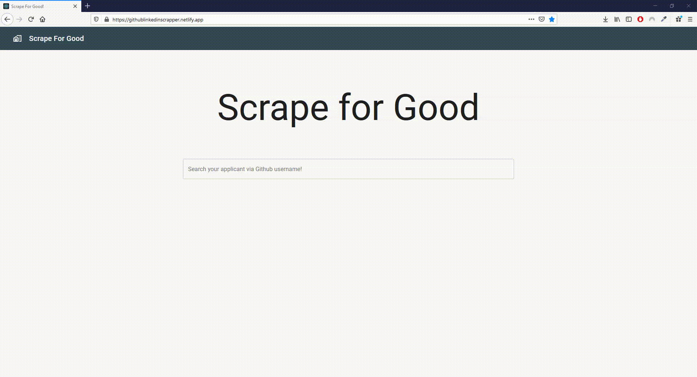

<h1 align="center">Scrape For Good</h1>

# Hack4Good2021

This project was a submission for the Hack4Good hackathon organized by Developer Student Club NUS, and we achieved the finalist position.

# Aim

Our website aims to help job-seeking applicants better reflect their understanding and interests.

We found out that employers do not have the neccessary time to slowly parse through all of the applicant's work to see if they have the proper tools.

We aim to solve that by parsing through the applicant's portfolio, and allow employers to decide at a glance if the tools the applicants have been using will make them a relevant fit for the employer's company.

# Implementation

For the hackathon, we managed to link up to a user's LinkedIn and Github account.  
We made a dictionary of terms, parsing through all the repositories of the user, and detected the libraries that were used, and mapped them to simple terms employers could understand, such as IO Processing, as well as the programming languages that were used.

# Team

Rajarshi Basu - Backend for Github (https://github.com/rajobasu, https://github.com/rajobasu/H4G-Githubscraper)  
Richard Yang - Backend for LinkedIn (https://github.com/RichardYCX, https://github.com/RichardYCX/Hack4Good-2021-LinkedIn_Keyword_Extractor)  
Amelia Tan - Pitch (https://github.com/AmeliaTYR)  
Fergus Mok - Frontend
